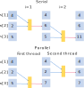

One of the classic applications of programming is linear algebra, in all of its beauty and complexity. We will use a few simple problems to see how to execute loops in parallel using OpenMP.

## Multiplying an array by a constant
The simplest problem is applying some function to an array of numbers. An example is multiplying each value by some constant number. In serial code you would loop over all array elements to do this multiplication:

~~~
/*  -- File array_multiply.c --- */
#include <stdio.h>
#include <stdlib.h>
#include <time.h>

int main(int argc, char **argv)
{
	struct timespec ts_start, ts_end;
	int size = 1e8;
	int multiplier = 2;
	int *a, *c;
	int i;
	float time_total;

	/* Allocate memory for arrays */
	a = malloc(size * sizeof(int));
	c = malloc(size * sizeof(int));

	/* Get start time */
	clock_gettime(CLOCK_MONOTONIC, &ts_start);

	/* Multiply array a by multiplier */
	for (i = 0; i < size; i++)
	{
		c[i] = multiplier * a[i];
	}

	/* Get end time */
	clock_gettime(CLOCK_MONOTONIC, &ts_end);

	time_total = (ts_end.tv_sec - ts_start.tv_sec) * 1e9 +
				 (ts_end.tv_nsec - ts_start.tv_nsec);
	printf("Total time is %f ms\n", time_total / 1e6);
}
~~~
{: .language-c}

- We added calls to *clock_gettime( )* function declared in the *time.h* header file to get the start and end times of the heavy work being done by the *for* loop. 
- We used counts of how many seconds and how many nanoseconds elapsed, that are returned in the structures *ts_start* and *ts_end*. Then we did some math to convert the elapsed time to milliseconds.

### Compiling and running a serial version
Compile the program. 
~~~
gcc array_multiply.c -o array_multiply
~~~
{:.language-bash}
Run it on the cluster.
~~~
srun --mem=2000 array_multiply
~~~
{:.language-bash}

> ## Time and Size
> Run the program several times and observe execution time. 
>- What happens to the run time of your program through multiple runs?  
>
> Change the size of the array, recompile and rerun the program. Observe execution time.  
>- Did execution time change proportionally to the size of the array?
{: .challenge}

### Creating a Parallel Version 
Let's parallelize this program using a *parallel* directive.  We need to make two changes:
1. Include OpenMP header file *omp.h*.
2. Tell compiler that we want to parallelize the main *for* loop.

~~~
/*  -- File array_multiply_omp.c --- */
#include <stdio.h>
#include <stdlib.h>
#include <time.h>
#include <omp.h> /* <--- OpenMP header --- */

int main(int argc, char **argv)
{
	struct timespec ts_start, ts_end;
	int size = 1e8;
	int multiplier = 2;
	int *a, *c;
	int i;
	float time_total;

	/* Allocate memory for arrays */
	a = malloc(size * sizeof(int));
	c = malloc(size * sizeof(int));

	/* Get start time */
	clock_gettime(CLOCK_MONOTONIC, &ts_start);

/* Multiply array a by multiplier */
#pragma omp parallel for /* <--- OpenMP parallel for loop --- */
	for (i = 0; i < size; i++)
	{
		c[i] = multiplier * a[i];
	}

	/* Get end time */
	clock_gettime(CLOCK_MONOTONIC, &ts_end);

	time_total = (ts_end.tv_sec - ts_start.tv_sec) * 1e9 +
				 (ts_end.tv_nsec - ts_start.tv_nsec);
	printf("Total time is %f ms\n", time_total / 1e6);
}
~~~
{: .language-c}

### Compiling and running a parallel version
Compile the program. 
~~~
gcc array_multiply_omp.c -o array_multiply_omp -fopenmp
~~~
{:.language-bash}
 Run it on the cluster with 4 threads.
~~~
srun -c4 --mem-per-cpu=1000 array_multiply_omp 
~~~
{:.language-bash}

> ## Using threads
> Run the program with different number of threads and observe how the runtime changes.  
> - What happens to the runtime when you change the number of threads?
{: .challenge}

In this example, the number of iterations around the *for* loop gets divided across the number of available threads. In order to do this, OpenMP needs to know how many iterations there are in the *for* loop. This leads to another requirement: the number of iterations can not change part way through the loop. For the same reasons *while* loops can not be parallelized.

To ensure the parallel *for* loop works correctly
- you must not change the value of *size* within one of the iterations.
- you must not use a call to `break()` or `exit()` within the *for* loop, either. These functions pop you out of the *for* loop before it is done.

## Summing the values in a matrix
Now let's try adding up the elements of a matrix.
Moving up to two dimensions adds a new layer of looping. The basic code looks like the following.
~~~
/* --- File matrix_sum_omp.c --- */
#include <stdio.h>
#include <stdlib.h>
#include <time.h>
#include <omp.h>

int main(int argc, char **argv)
{
	struct timespec ts_start, ts_end;
	int size = 1e4;
	int **a, *c;
	int i, j;
	float time_total;

	/* Allocate memory */
	c = malloc(size * sizeof(int));
	a = (int **)malloc(size * sizeof(int *));
	for (i = 0; i < size; i++)
		a[i] = malloc(size * sizeof(int));

	/* Set all matrix elements to 1 */
	for (i = 0; i < size; i++)
	{
		for (j = 0; j < size; j++)
		{
			a[i][j] = 1;
		}
	}

	/* Zero the accumulator */
	for (i = 0; i < size; i++)
	{
		c[i] = 0;
	}

	clock_gettime(CLOCK_MONOTONIC, &ts_start);

#pragma omp parallel for
	/* Each thread sums one column */
	for (i = 0; i < size; i++)
	{
		for (j = 0; j < size; j++)
		{
			c[i] += a[i][j];
		}
	}

	int total = 0;
	/* Add sums of all columns together */
	for (i = 0; i < size; i++)
	{
		total += c[i];
	}

	clock_gettime(CLOCK_MONOTONIC, &ts_end);
	time_total = (ts_end.tv_sec - ts_start.tv_sec) * 1e9 +
				 (ts_end.tv_nsec - ts_start.tv_nsec);
	printf("Total is %d, time is %f ms\n", total, time_total / 1e6);
}

~~~
{: .language-c}

> ## Is the result correct?
> 1. What should be the result of this code?  
> 2. Is that what it does?  If not, what might be wrong?    
>
> > ## Solution
> > 1. The elements all have value 1, and there are 1e4*1e4 of them, so the total should be 1e8. Why isn't it?
> > 2. OpenMP threads share memory. This means that every thread
> > can see and access all of memory for the process. In this case, multiple threads are all accessing the loop variable *j*. Threads that started last will reset *j* and as a result threads that started before will count elements more than once.
>>
> {: .solution}
{: .challenge}

### OpenMP *private* clause
To run the above task correctly in parallel each thread must have its own copy of the variable *j*. This can be achieved by declaring variables as *private*:

~~~
#pragma omp parallel for private(j)
~~~
{: .language-c}

This directive tells compiler that every thread must use its own private copy of *j*.  

When a variable is declared private, OpenMP replicates this variable and assigns its local copy to each thread. Private copies of the variable are initialized from the original object when entering the region.

- variables declared outside of a parallel region are implicitly shared 
- variables declared inside are implicitly private.

Thus another way to fix this problem is to define *j* inside the parallel *for* loop. That's perfectly valid, but it will require changing code. One of the goals of OpenMP is to allow parallelization by only adding pragma statements that can be enabled or disabled at compile time.

## Be Careful with Data Dependencies
In turning a serial program into a parallel program, it's vital to maintain the correctness of the serial program. Data dependency is an important concept we use to guarantee that we're transforming a serial program into an equivalent (in terms of its output) parallel program.

What is data dependency? If two statements read or write the same memory location, and at least one of the statements writes that memory location, then there is a *data dependency* on that memory location between the two statements. Loops with data dependencies can not be executed in parallel because the results may not be correct.

_If there is a data dependency between two statements, then the order in which those statements are executed may affect the output of the program, and hence its correctness._

Consider this loop that computes a cumulative sum:
~~~
for ( i = 1; i < N - 1; i = i + 1 ) {
    a[i] = a[i] + a[i+1];
}
~~~
{: .language-c}

If we run to run this loop in parallel different iterations would be carried out by different threads of execution. If any two iterations didn't happen in the order dictated by the serial code, as shown in the figure below, the results would be wrong.

#### Types of data dependencies:
Since either of the two statements can read or write a variable, there are four types of data dependencies.

- FLOW (READ after WRITE), like the last example, when one statement uses the results of another.
- ANTI (WRITE after READ), when one statement should write to a location only ''after'' another has read what's there.
- OUTPUT (WRITE after WRITE), when two statements write to a location, so the result will depend on which one wrote to it last.  
- INPUT (READ after READ). Both statements read a variable. Since neither tasks writes, they can run in either order.

[View wikipedia page on data dependencies](https://en.wikipedia.org/wiki/Data_dependency)

> ## Is There a Dependency?
>
> Which of the following loops have data dependencies?
>
> ~~~
> /* loop #1 */
> for ( i=2; i<N; i=i+2 ) {
>     a[i] = a[i] + a[i-1]; }
>
> /* loop #2 */
> for ( i=1; i<N/2; i=i+1 ) {
>     a[i] = a[i] + a[i+N/2]; }
>
> /* loop #3 */
> for ( i=0; i<N/2+1; i=i+1 ) {
>     a[i] = a[i] + a[i+N/2]; }
>
> /* loop #4 */
> for ( i=1; i<N; i=i+1 ) {
>     a[idx[i]] = a[idx[i]] + b[idx[i]]; } 
> ~~~
> {: .language-c}
>
> > ## Solution
> >
> > Loop #1 does not. The increment of this loop is 2, so in the step 2 we compute a[2]=a[2]+a[1]. In the next step we compute a[4]=a[4]+a[3] ... etc.  
> > Loop #2 does not. In this range of *i* values each thread modifies only one element of the array *a*.  
> > Loop #3 does. Here the last iteration creates data dependency writing to a[N/2]:
> >~~~
> >i=N/2; a[N/2] = a[N/2] + a[N]  
> >i=0;   a[0] = a[0] + a[N/2]
> >~~~
> >{: .code}
> > Loop #4 might or might not, depending on the contents of the array *idx*.
> > If any two entries of *idx* are the same, then there's a dependency.
> >
> {: .solution}
{: .challenge}

Not everything can be parallelized. If there is data dependency you may need to modify your algorithm to be more parallel-friendly. Spend some time (drawing diagrams may help) to see what happens when two (or more) threads work simultaneously on a loop. It's not pretty. One of the strategies for solving some data dependency problems may be to write into a new copy of an array and at the end of each iteration update old from new. 

## Thread-safe functions
Another important concept is that of a *thread-safe* function.  

Consider this code;

~~~
#pragma omp parallel for
for(i = 0, i < N, i++)
	y[i] = func(x[i])
~~~
{:.language-c}

Will this give the same results as the serial version?  
Maybe ... It depends on what function does. If the result does not depend on the order threads use different values of *i*, then the function is thread safe.

*A thread-safe function is one which can be called simultaneously by multiple threads of execution.*

Consider the function computing distance between two points in 2D:
~~~
float funct(float *p1, float *p2)
{
	float dx, dy;
	dx = p2[0]-p1[0];
	dy = p2[1]-p1[1];
	return(sqrt(dx*dx + dy*dy));
}
~~~
{:.language-c}

Execution of this function for different values of p1 and p2 is completely independent. Note that each call creates a new local values dx and dy on the call stack, so they are private to the thread executing the function. This function is thread safe.

Consider a modified version of the code where dx and dy are defined outside of the function:

~~~
float dx, dy;
float funct(float *p1, float *p2)
{
	dx = p2[0]-p1[0];
	dy = p2[1]-p1[1];
	return(sqrt(dx*dx + dy*dy));
}
~~~
{:.language-c}

The variables dx and dy may be modified by another thread after they are computed and before they are used. This function is not thread-safe.

You need to be aware when writing multi-threaded programs whether functions you are using are thread safe or not. For example random number generator rand( ) is not thread safe. For threaded applications thread safe version of random number generator rand_r( ) is available. 

For more, see [Thread safety](https://en.wikipedia.org/wiki/Thread_safety).

### Optimizing performance
#### CPU cache and data locality
Let's do a quick experiment. Compile our matrix_multiply_omp.c code with Intel compiler:
~~~
module load StdEnv/2020 intel/2021.2.0
icc matrix_multiply_omp.c -gopenmp
~~~
{:.language-bash}

Run on 4 CPUs and record timing. On our training cluster you will get something like:

~~~
srun --mem-per-cpu=2000 -c4 ./a.out
~~~
{:.language-bash}
~~~
Total is 100000000, time is 17.243648 ms
~~~
{:.output}

Then swap *i* and *j* indexes in line 38 of the main loop:
~~~
#pragma omp parallel for
        for (i = 0; i<size; i++) {
                for (int j=0; j<size; j++) {
                        c[i] += a[i][j]; /* <-- Swap indexes --- */
                }
        }
~~~
{:.language-c}

Recompile the program and run it again.

~~~
Total is 100000000, time is 521.661536 ms
~~~
{:.output}

What is going on?   
Modern compilers should be smart enough to figure out how to maximize the performance, right? 

Modern CPUs are fast, and main memory access is relatively slow. This can be a huge processing bottleneck because CPU will idle for many cycles waiting for the data. As a compromise, CPU manufacturers add some fast memory on the CPU chip. This memory is called CPU cache. Cache organization is fairly complex, with several cache levels differing in the access time.

When we want to loop through an array, the first access would go to memory to fetch data, and this is a very slow operation. To deal with this bottleneck upon the first access to the array instead of grabbing just one element CPU grabs a large chunk of data and puts it into the cache. The next time the CPU needs some data it first looks in the cache. 

if we organize our computations such that once a chunk of data is fetched into the cache all that data is used in the computation before a different line is fetched, our program will run a lot faster than if CPU will keep fetching  data from different parts of memory. This is called data locality.

Taking advantage from cache is possible only if an array we are looping through is stored sequentially as contiguous memory block. 

C/C++ compiler stores static matrices in row-major order. Although we did not use static array, we stored our matrix in the same way. So if our inner loop iterates through elements of a row as shown in the diagram below, then a chunk of a row  will be loaded into cache upon the first access. 

~~~
                             j=1               j=2   
   1    2 ... 1000 ... -->  1 2 ... 1000 
1001 1002 ... 2000 ... -->                 1001 1002 ... 2000 
2001 2002 ... 3000 ...
...
~~~

This will not happen if in out inner loop we iterate through elements of a column (loop variable *i*) because columns are not contiguous memory blocks:
~~~
                              i=1                 i=2   
   1    2 ... 1000 ... -->  1 1001 2001 ...   2 1002 2002 ...   
1001 1002 ... 2000 ...
2001 2002 ... 3000 ...
...
~~~
In this case, CPU will need to access main memory to load each matrix element.

#### Avoid parallel overhead at low iteration counts
Creating a thread is expensive, it may cost thousands of CPU cycles. f you have a function that requires only hundreds of cycles, it is wasteful to parallelize it. The overhead alone will set you back. This can be avoided using conditional parallelization:

~~~
#pragma omp parallel for if(N > 1000) 
for(i = 0; i < N; i++)
	{
		a[i] = k*b[i] + c[i];
	}
~~~
{:.language-c}

#### Minimize parallelization overhead
If the inner loop is parallelized, in each iteration step of the outer loop, a parallel region is created. This causes parallelization overhead.
