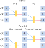

One of the classic applications of programming is linear algebra, in all of its beauty and complexity. We will explore a few simple linear algebra problems that benefit from being run in parallel using OpenMP.

## Multiplying an Array by a Constant
A simple problem involves applying some function to a collection of numbers.  Multiplying array by a constant number is an example. To do this multiplication in serial code, you would loop over all array elements:

~~~
#include <stdio.h>
#include <stdlib.h>
#include <omp.h>

int main(int argc, char **argv)
{
        double start, end;
        int size = 5e8;
        int multiplier = 2;
        int *A, *C;
        int i;

        /* Allocate memory for arrays */
        A = malloc(size * sizeof(int));
        C = malloc(size * sizeof(int));

        start = omp_get_wtime();
        /* Multiply array a by multiplier */
        for (i = 0; i < size; i++)
        {
                C[i] = multiplier * A[i];
        }
        end = omp_get_wtime();
        printf("Total time is %f s\n", end-start);
}
~~~
{: .language-c}
[array_multiply_template.c](https://github.com/ssvassiliev/ACENET_Summer_School_OpenMP_2023/raw/gh-pages/code/array_multiply_template.c)

- We added calls to the `omp_get_wtime()` function declared in the `omp.h` header file to get the start and end times of the heavy work being done by the `for` loop. 

### Compiling and Running a Serial Version
Compile the program. 
~~~
gcc array_multiply_template.c -o array_multiply_serial -fopenmp
~~~
{:.language-bash}
Run it on the cluster.
~~~
srun --mem=5000 array_multiply_serial
~~~
{:.language-bash}  

> ## Time and Size
> Run the program several times and observe execution time. 
>- What happens to the run time of your program through multiple runs?  
>
> Change the size of the array, recompile and rerun the program. Observe execution time.  
>- Did execution time change proportionally to the size of the array?
{: .challenge}

### Creating a Parallel Version 
Let's parallelize this program using a `parallel` directive.    
- We need to tell compiler that we want to parallelize the main `for` loop.

~~~
...
        /* Multiply array a by multiplier */
	#pragma omp parallel for /* <--- OpenMP parallel for loop --- */
        for (i = 0; i < size; i++)
...
~~~
{: .language-c}
array_multiply_omp.c  

### Compiling and Running a Parallel Version
Compile the program. 
~~~
gcc array_multiply_omp.c -o array_multiply_omp -fopenmp
~~~
{:.language-bash}
 Run it on the cluster with 4 threads.
~~~
srun -c4 --mem=5000 array_multiply_omp 
~~~
{:.language-bash}

> ## Using Threads
> Run the program with different number of threads and observe how the runtime changes.  
> - What happens to the runtime when you change the number of threads?
{: .challenge}

In this example, the number of loop iterations is divided over the number of available threads. OpenMP must know how many iterations are in the loop before it can do this. This leads to another requirement: the number of iterations must not change midway through the loop. For the same reasons `while` loops can not be parallelized.
{:.instructor_notes}

To ensure the parallel `for` loop works correctly:
- you must not change the number of loop iterations (the variable `size` in the example above) within one of the iterations.
- you must not use a call to `break()` or `exit()` within the `for` loop, either. These functions pull you out of the `for` loop before it is done.

## Summing the Values in a Matrix
Now let's try adding up the elements of a matrix. Adding a second array dimension creates another layer of looping. Let's take a look at the basic code:
{:.instructor_notes}

- The basic example code:
{:.self_study_text}

~~~
#include <stdio.h>
#include <stdlib.h>
#include <omp.h>

int main(int argc, char **argv)
{
    double start, end;
    int size = 1e4;
    int **A, *C;
    int i, j;

    /* Allocate memory */
    C = malloc(size * sizeof(int));
    A = (int **)malloc(size * sizeof(int *));
    for (i = 0; i < size; i++)
        A[i] = malloc(size * sizeof(int));
    /* Set all matrix elements to 1 */
    for (i = 0; i < size; i++)
        for (j = 0; j < size; j++)
            A[i][j] = 1;
    /* Zero the accumulator */
    for (i = 0; i < size; i++)
        C[i] = 0;

    start = omp_get_wtime();
    #pragma omp parallel for
    /* Each thread sums one column */
    for (i = 0; i < size; i++)
        for (j = 0; j < size; j++)
            C[i] += A[i][j];
        
    int total = 0;
    /* Add sums of all columns together */
    for (i = 0; i < size; i++)
        total += C[i];

    end = omp_get_wtime();
    printf("Total is %d, time is %f s\n", total, end-start);
}
~~~
{: .language-c}

> ## Is the result correct?
> 1. What should be the result of this code?  
> 2. Is that what it does?  If not, what might be wrong?    
>
> > ## Solution
> > 1. The elements all have value 1, and there are 1e4*1e4 of them, so the total should be 1e8. Why isn't it?
> > 2. OpenMP threads share memory. This means that every thread
> > can see and access all of memory for the process. In this case, multiple threads are all accessing the loop variable *j*. Threads that started last will reset *j* and as a result threads that started before will count some elements more than once.
>>
> {: .solution}
{: .challenge}

### The *omp private* Clause
To run the above task correctly in parallel each thread must have its own copy of the variable *j*. This can be achieved by declaring variables as *private*:

~~~
#pragma omp parallel for private(j)
~~~
{: .language-c}

This directive tells compiler that every thread must use its own private copy of *j*.  

When a variable is declared private, OpenMP replicates this variable and assigns its local copy to each thread. Private copies of the variable are initialized from the original object when entering the region.

- variables declared outside of a parallel region are implicitly shared 
- variables declared inside are implicitly private.

Thus another way to fix this problem is to define *j* inside the parallel `for` loop. That's perfectly valid, but it will require changing code. One of the goals of OpenMP is to allow parallelization by only adding pragma statements that can be enabled or disabled at compile time.

### Be Cautious About Data Dependencies
In turning a serial program into a parallel program, it's vital to maintain the correctness of the serial program. Data dependency is an important concept we use to guarantee that we're transforming a serial program into an equivalent (in terms of its output) parallel program.
{:.instructor_notes}

What is data dependency? If two statements read or write the same memory location, and at least one of the statements writes that memory location, then there is a *data dependency* on that memory location between the two statements. Loops with data dependencies can not be executed in parallel because the results may not be correct.
{:.instructor_notes}

- If there is a data dependency between two statements, then the order in which those statements are executed may affect the output of the program, and hence its correctness.

Consider this loop that computes a cumulative sum:
~~~
for ( i = 1; i < N - 1; i = i + 1 ) {
    a[i] = a[i] + a[i-1];
}
~~~
{: .language-c}

If we run this loop in parallel different iterations would be carried out by different threads of execution. If any two iterations didn't happen in the order dictated by the serial code, as shown in the figure below, the results would be wrong.

#### Types of Data Dependencies:
Since either of the two statements can read or write a variable, there are four types of data dependencies.

- FLOW (READ after WRITE), like the last example, when one statement uses the results of another.
- ANTI (WRITE after READ), when one statement should write to a location only ''after'' another has read what's there.
- OUTPUT (WRITE after WRITE), when two statements write to a location, so the result will depend on which one wrote to it last.  
- INPUT (READ after READ). Both statements read a variable. Since neither tasks writes, they can run in either order.

[View wikipedia page on data dependencies](https://en.wikipedia.org/wiki/Data_dependency)

> ## Is There a Dependency?
>
> Which of the following loops have data dependencies?
>
> ~~~
> /* loop #1 */
> for ( i=2; i<N; i=i+2 ) {
>     a[i] = a[i] + a[i-1]; }
>
> /* loop #2 */
> for ( i=1; i<N/2; i=i+1 ) {
>     a[i] = a[i] + a[i+N/2]; }
>
> /* loop #3 */
> for ( i=0; i<N/2+1; i=i+1 ) {
>     a[i] = a[i] + a[i+N/2]; }
>
> /* loop #4 */
> for ( i=1; i<N; i=i+1 ) {
>     a[idx[i]] = a[idx[i]] + b[idx[i]]; } 
> ~~~
> {: .language-c}
>
> > ## Solution
> >
> > Loop #1 does not. The increment of this loop is 2, so in the first step we compute a[2]=a[2]+a[1]. In the next step we compute a[4]=a[4]+a[3] ... etc.  
> > Loop #2 does not. In this example we are summing array elements separated by half array size. In this range of *i* values each thread modifies only one element of the array *a*.  
> > Loop #3 does. Here the last iteration creates data dependency writing to a[N/2] because a[N/2] is used when i=0:
> >~~~
> >i=N/2; a[N/2] = a[N/2] + a[N]  
> >i=0;   a[0] = a[0] + a[N/2]
> >~~~
> >{: .code}
> > Loop #4 might or might not, depending on the contents of the array *idx*.
> > If any two entries of *idx* are the same, then there's a dependency.
> >
> {: .solution}
{: .challenge}

- Take a look at your code for data dependencies and eliminate them where you can.
- The method of writing into a new array and updating old from new after each iteration is one approach.
{:.self_study_text}

Parallelization isn't always possible. If your algorithm has data dependency, you may have to modify it to make it more parallel-friendly. Think about what happens when two (or more) threads work on the same loop at the same time (drawing diagrams may help). It is sometimes difficult to understand how multiple threads behave. In order to solve some data dependency issues, one method is to write into a new copy of an array and update old from new at the end of each iteration when all threads have completed.
{:.instructor_notes}

### Thread-safe Functions
Using *thread-safe* functions is also an important concept. 
{:.instructor_notes}

Consider this code:
~~~
#pragma omp parallel for
for(i = 0, i < N, i++)
	y[i] = func(x[i])
~~~
{:.language-c}

Will this give the same results as the serial version?  
It depends on what function does.
{:.self_study_text}

Maybe ... It depends on what function does. If the result does not depend on the other threads using different values of *i* at the same time, then the function is thread safe. In other words if function works correctly when it is executed with multiple threads it is thread safe.
{:.instructor_notes}

- *The term thread-safe function refers to a function that can be called concurrently by multiple threads.*

Let us consider the function for computing the distance between two points in 2D:
~~~
float funct(float *p1, float *p2)
{
	float dx, dy;
	dx = p2[0]-p1[0];
	dy = p2[1]-p1[1];
	return(sqrt(dx*dx + dy*dy));
}
~~~
{:.language-c}

- This function is thread-safe because dx and dy are private.
{:.self_study_text}

Execution of this function for different values of p1 and p2 is completely independent. Whenever a new function call is made, new local values dx and dy are created on the stack, so they are private to the thread. This function is thread safe.
{:.instructor_notes}

Imagine a modified version of the code where dx and dy are defined externally to the function:
{:.instructor_notes}

~~~
float dx, dy;
float funct(float *p1, float *p2)
{
	dx = p2[0]-p1[0];
	dy = p2[1]-p1[1];
	return(sqrt(dx*dx + dy*dy));
}
~~~
{:.language-c}

- This function is not thread-safe because dx and dy are global and can be modified by any thread.
{:.self_study_text}

In this case, after dx and dy have been computed, another thread may modify them before they are used. This function is not thread-safe.
{:.instructor_notes}

- Be aware of whether functions you use are thread safe or not.
{:.self_study_text}

When writing multi-threaded programs, you should be aware of whether functions you use are thread safe or not. For example random number generator rand( ) is not thread safe. For threaded applications thread safe version of random number generator rand_r( ) is available. 
{:.instructor_notes}

For more, see [Thread safety](https://en.wikipedia.org/wiki/Thread_safety).

### Optimizing Performance
#### CPU Cache and Data Locality
Let's do a quick experiment. Compile our matrix_multiply_omp.c code with Intel compiler:
~~~
module load intel/2022.1.0
icc matrix_multiply_omp.c -gopenmp
~~~
{:.language-bash}

Run on 4 CPUs and record timing. On our training cluster you will get something like:

~~~
srun --mem-per-cpu=2000 -c4 ./a.out
~~~
{:.language-bash}
~~~
Total is 100000000, time is 0.021937 s
~~~
{:.output}

Then swap *i* and *j* indexes in the main for loop:
~~~
...
	#pragma omp parallel for
    for (i = 0; i<size; i++) 
        for (int j=0; j<size; j++) 
                C[i] += A[i][j]; /* <-- Swap indexes --- */
...
~~~
{:.language-c}

Recompile the program and run it again.

~~~
Total is 100000000, time is 0.676217 s
~~~
{:.output}

What is going on? 

- CPU cache helps to accelerate computations by eliminating memory bottlenecks.
- To take advantage of CPU cache, an array we are looping through must be stored sequentially as a contiguous memory block.
{:.self_study_text} 

A modern compiler should be smart enough to maximize the performance, right?
{:.instructor_notes}

While modern CPUs are fast, main memory access is relatively slow. This can lead to a major bottleneck in processing, as the CPU will remain idle while waiting for the data. As a compromise, CPU manufacturers add some fast memory on the CPU chip. This memory is called CPU cache. Cache organization is fairly complex, with several cache levels differing in the access time.
{:.instructor_notes}

When we want to loop through an array, the first access would go to main memory to fetch data, and this is a very slow operation. To deal with this bottleneck upon the first access to the array instead of grabbing just one element CPU grabs a large chunk of data and puts it into the cache. The next time the CPU needs some data it first looks in the cache. 
{:.instructor_notes}

If we organize our computations so that once our program fetches a chunk of data into the cache, all of that data is used prior to the next chunk being fetched, we will be able to run our program much faster than if the CPU was continually fetching data from different parts of memory. This is called data locality.
{:.instructor_notes}

In order to take advantage of CPU cache, an array we are looping through must be stored sequentially as a contiguous memory block.
{:.instructor_notes}

C/C++ compiler stores static matrices in row-major order. Although we did not use static array, we stored our matrix in the same way. So if our inner loop iterates through elements of a row (j) as shown in the diagram below, then a chunk of a row  will be loaded into cache upon the first access. 
{:.instructor_notes}

If inner loop iterates through elements of a row then chunk of a row is loaded into cache upon the first access: 
{:.self_study_text} 

~~~
                                      inner loop
                             j=1               j=2   
   1    2 ... 1000 ... -->  1 2 ... 1000 
1001 1002 ... 2000 ... -->                 1001 1002 ... 2000 
2001 2002 ... 3000 ...
...
~~~

This will not happen if in the inner loop we iterate through elements of a column (loop variable *i*) because columns are not contiguous memory blocks:
~~~
                              i=1                 i=2   
   1    2 ... 1000 ... -->  1 1001 2001 ...   2 1002 2002 ...   
1001 1002 ... 2000 ...
2001 2002 ... 3000 ...
...
~~~
In this case, CPU will need to access main memory to load each matrix element.

#### Avoiding Parallel Overhead at Low Iteration Counts
Creating a thread is expensive, it may cost thousands of CPU cycles. If you have a function that requires only hundreds of cycles, it is wasteful to parallelize it. The overhead alone will set you back. This can be avoided using conditional parallelization:
{:.instructor_notes}

- Use conditional parallelization:
{:.self_study_text} 
~~~
#pragma omp parallel for if(N > 1000) 
for(i = 0; i < N; i++){
	a[i] = k*b[i] + c[i];
}
~~~
{:.language-c}

#### Minimizing Parallelization Overhead
If the inner loop is parallelized, in each iteration step of the outer loop, a parallel region is created. This causes parallelization overhead.
