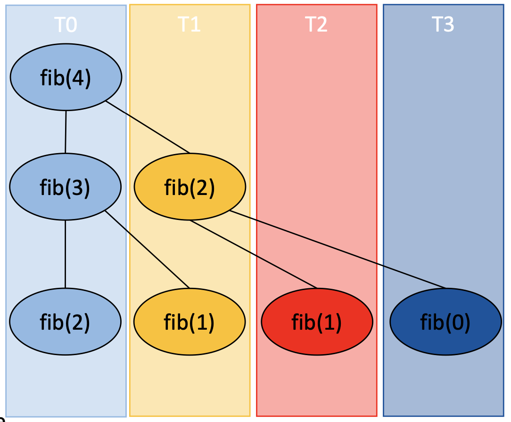

## Introduction
The last construct we will look at is the *omp task*. It is the most recent addition to OpenMP specification introduced in version 3.0 in 2008. Older constructs worked well for many cases but there were limitations hampering development of rapidly developing advanced applications.   
- Only loops with a known length at run time were allowed, and only finite number of parallel sections.

This didn’t work well with certain common problems such as recursive or pointer-chasing algorithms.

- Pointer chasing algorithms employ a series of irregular memory access patterns where the data of the previous memory access is required in order to determine the memory address of the next pointer.

Another flow control statement that was hard to parallelize was the *while* loop with it's unknown number of iterations.

The *omp task* construct addresses these issues by generating tasks that are then executed by all available threads. 

## The *omp task*
What is a task?   
- A task is composed of the code to be executed and the data environment (inputs to be used and outputs to be generated).

General concept of tasks is not new to OpenMP, but before introduction of the *omp task* construct tasks were implicit. For example an *omp parallel* construct creates implicit tasks, one task per thread and tasks execution begins.  

The *omp task* specification introduced a different model. When a thread encounters the *task* construct it will create an explicit task. The execution of an explicit task may be immediate or delayed. If delayed, the task in placed in a pool of tasks associated with the current parallel region. All available threads can take tasks out of the pool and execute them until the pool is empty. The OpenMP specification further permits an implementation to suspend the generation of tasks, and to suspend the execution of specific tasks, in order to maintain system efficiency.

Due to its dynamic nature, a tasking implementation is more complicated than its static counterparts. In addition to the basic functions of creating and controlling dependencies between tasks, the run-time tasking implementation need to decide how and when to schedule tasks. The function of an ideal scheduler is very complex: it should be able to dynamically balance the workload on the threads, ensuring that all the threads do the same amount of work.
At the same time it should consider data locality. To address the latter tasks operating on the same data should be scheduled for execution on the same thread to improve data reuse and maximize performance.

Another important problem affecting performance is task  generation. A task-generating program can overload a system’s resources, like memory usage, placing a strain on the system. Recursive algorithms, in particular, can quickly generate millions of tasks.

As the OpenMP specification does not prescribe the algorithm for scheduling tasks for execution, the implementation of the scheduling is compiler-specific. 

A typical program using tasks would follow the code shown below:
~~~
/* Create threads */
#pragma omp parallel 
{
    #pragma omp single 
    { 
        for(i<1000) /* Generate tasks */
        #pragma omp task
           work_on(i) 
    }
}
~~~
{:.language-c}

- A parallel region creates a team of threads 
- A single thread then creates the tasks, adding them to a pool that belongs to the team
- All the threads in that team execute tasks from this queue. Tasks could run in any order.

If you need to have results from the tasks before you can continue, you can use the *taskwait* directive to pause your program until the tasks are done.

### Finding the Smallest Factor
Let's use tasks to find the smallest factor of a large number (using 4993*5393 as test case). Start with the serial code:
~~~
/* File: find_factor.c */
#include <stdio.h>
#include <stdlib.h>

int main()
{
    int N = 26927249;
    int f;
    for (f = 2; f <= N; f++)
    {
        if (f % 200 == 0) /* Print progress */
        {
            fprintf(stdout, "checking: %li\n", f);
            fflush(stdout);
        }
        /* Check if f is a factor */
        if (N % f == 0)
        { // The remainder is 0, found factor!
            fprintf(stdout, "Factor: %li\n", f);
            exit(0); /* Terminate the program */
        }
        for (int i = 1; i < 4e6; i++)
            ; /* Burn some CPU cycles */
        /* End of factor finding block */    
    }
}
~~~
{:.language-c}

- Turn the factor finding block into a task.
- Generate a task for each trial factor.
- Once a factor has been found, you should stop generating tasks.

~~~
/* File find_factor_omp.c */
#include <stdio.h>
#include <stdlib.h>

int main()
{
  long N = 4993 * 5393;
  long f;
#pragma omp parallel
#pragma omp single
  for (f = 2; f <= N; f++) /* Loop generating tasks */
  {
    if (f % 200 == 0) /* Print progress */
    {
      fprintf(stdout, "%li tasks generated\n", f);
      fflush(stdout);
    }
#pragma omp task
    { /* Check if f is a factor */
      if (f % 200 == 0) /* Print progress */
        fprintf(stdout, "    %li tasks done\n", f);
      if (N % f == 0)
      { // The remainder is 0, found factor!
        fprintf(stdout, "Factor: %li\n", f);
        exit(0); /* Terminate the program */
      }
      else
        for (int i = 1; i < 4e6; i++)
          ; /* Burn some CPU cycles */
    }
  } 
}
~~~
{:.language-c}

- Run the program in parallel and compare execution time with the serial version.  

~~~
time srun ./a.out
time srun -c4 ./a.out
~~~
{:.language-bash}

-  How many tasks are in the pool? Not all tasks are generated right away. A scheduler controls the size of the task pool to prevent the overloading of the system. At some point, when the list of deferred tasks is too long, the implementation is allowed to stop generating new tasks, and switches every thread in the team on executing already generated tasks. 
- Try submitting a job with more threads and look at how many tasks will be generated.

~~~
time srun -c4 --export OMP_NUM_THREADS=20 ./a.out
~~~
{:.language-bash}

### Task Synchronization
Some applications require tasks to be executed in a certain order, but it is impossible to know when a task will be executed because a scheduler decides when and where to run a task. Several OpenMP directives are available for task synchronization. 

For example, consider the code:

~~~
x = f();
#pragma omp task
{ y1 = g1(x); }
#pragma omp task
{ y2 = g2(x); }
z = h(y1) + h(y2);
~~~
{:.language-c}

When the statement computing z is executed, the tasks computing  *y1* and *y2* have only been scheduled; they have not necessarily been executed yet. To fix this we need to explicitly wait until tasks computing *y1* and *y2* are finished before computing *z*. For this we need to use the *omp taskwait* directive: 

~~~
x = f();
#pragma omp task
{ y1 = g1(x); }
#pragma omp task
{ y2 = g2(x); }
#pragma omp taskwait
z = h(y1) + h(y2);
~~~
{:.language-c}

This corrected code will generate two tasks and wait for both of them to be finished before computing *z*. 

### Controlling Task Execution Order
In some cases a task may depend on another task, but not on all generated tasks. The *taskwait* directive in this case is too restrictive. 
~~~
#pragma omp task /* task A */
preprocess_data(A);
#pragma omp task /* task B */
preprocess_data(B);

#pragma omp taskwait

#pragma omp task /* task C */
compute_stats(A);
#pragma omp task /* task D */
compute_stats(B);
~~~
{:.language-c}

In this case *task C* should be executed after *task A*, but it won’t run until the execution of *task B* is finished.

The *task depend* clause allows you to provide information on the order in which tasks should be executed. However, the best way to understand task dependencies concept is to think of them as of the way to describe how different tasks access data and not in what order they should be executed.

- The *depend* clause is followed by an access mode that can be *in*, *out* or *inout*.
- *depend(in:x)* - task will read variable *x*
- *depend(out:y)* - task will write variable *y*, previous value of *y* will be ignored.
- *depend(inout:z)* - task will both read and write variable *z*
- The OpenMP scheduler considers task dependencies and automatically decides whether a task is ready for execution.

The previous example rewritten with task dependencies will be:
~~~
#pragma omp task depend(out:A) /* task A */
preprocess_data(A);
#pragma omp task depend(out:B)/* task B */
preprocess_data(B);

#pragma omp taskwait
#pragma omp task depend(in:A)/* task C */
compute_stats(A);
#pragma omp task depend(in:B)/* task D */
compute_stats(B);
~~~
{:.language-c}

This example illustrates READ after WRITE dependency:  *task A* writes A, which is then read by  *task C*.

The depend clause enforces additional constraints on the scheduling of tasks or loop iterations. These constraints establish dependencies only between sibling tasks or between loop iterations. The task dependencies are fulfilled when the predecessor task has completed.

> ## Controlling Order of Data Access
> Consider the following loop:
>
> ~~~
> for(i=1;i<N;i++)
>   for(j=1;j<N;j++)
>     x[i][j] = x[i-1][j] + x[i][j-1];
> ~~~
> {:.language-c}
>
> The loop cannot be parallelized with *parallel for* construct due to data dependency. The next task should be executed after the previous task updates the variable *x*.
- Use tasks with dependencies to parallelize this code. 
- You should be able to correct the code  by only adding the *depend* clause. 
- Start with the incorrectly parallelized code:
>
> ~~~
>/* --- File task_depend_omp.c --- */
>#include <stdlib.h>
>#include <stdio.h>
>
>int main(int argc, char **argv)
>{
>
>  int N = 8;
>  int x[N][N], y[N][N];
>  int i, j;
>
>  /* Initialize x,y */
>  for (i = 0; i < N; i++)
>  {
>    x[0][i] = x[i][0] = y[0][i] = y[i][0] = i;
>  }
>
>  /* Serial computation */
>  for (i = 1; i < N; i++)
>  {
>    for (j = 1; j < N; j++)
>      x[i][j] = x[i - 1][j] + x[i][j - 1];
>  }
>
>  /* Parallel computation */
>#pragma omp parallel
>#pragma omp single
>  for (i = 1; i < N; i++)
>  {
>    for (j = 1; j < N; j++)
>#pragma omp task
>      y[i][j] = y[i - 1][j] + y[i][j - 1];
>  }
>
>  printf("Serial result:\n");
>  for (i = 0; i < N; i++)
>  {
>    for (j = 0; j < N; j++)
>      printf("%6d", x[i][j]);
>    printf("\n");
>  }
>  printf("Parallel result:\n");
>  for (i = 0; i < N; i++)
>  {
>    for (j = 0; j < N; j++)
>      printf("%6d", y[i][j]);
>    printf("\n");
>  }
>}
> ~~~
> {:.language-c}
> > ## solution
> > Parallel threads are writing data, so the dependence should be *depend(out:y)*
> {: .solution}
{: .challenge}

>## Computing Fibonacci Numbers
>The next example shows how  *task* and *taskwait* directives can be used to compute Fibonacci numbers recursively.
>
>- In the *parallel* construct, the *single* directive calls *fib(n)*.  
>- The call to *fib(n)* generates two tasks. One of the tasks computes *fib(n-1)* and the other computes *fib(n-2)*. 
>- The two return values are added together to produce the value returned by *fib(n)*. 
>- Each of the calls to *fib(n-1)* and *fib(n-2)* will in turn generate two tasks. Tasks will be recursively generated until the argument passed to *fib()* is less than 2.
> 
>The *taskwait* directive ensures that both tasks generated in *fib( )* compute *i* and *j* before return.
>
>~~~
>/* --- File fib.c ---*/
>#include <stdio.h>
>#include <stdlib.h>
>#include <omp.h>
>
>/* Usage: ./fib [n] */
>/* Default n=10 */
>
>int fib(int n) {
>   int i, j;
>   if (n<2)
>      return n;
>   else {
>      #pragma omp task shared(i)
>      i=fib(n-1);
>      #pragma omp task shared(j)
>      j=fib(n-2);
>      #pragma omp taskwait
>      return i+j;
>   }
>}
>
>int main(int argc, char **argv){
>   int n=10, result;
>   if(argc==2) {
>       char *a = argv[1];
>       n = atoi(a);
>   }
>
>   #pragma omp parallel
>   {
>      #pragma omp single
>      result = fib(n);
>   }
>   printf("Fibonacci number %d is %d\n", n, result);
>}
>~~~
>{:.language-c}
{:.callout}

> ## Tasks?
> How do tasks work with different number of threads?
>> ## Solution
>>Each task region will be executed by one thread. OpenMP will not use more threads to execute a single task. 
>>
>{:.solution}
{: .challenge}

> ## Task gotchas
> There are a few gotchas to be aware of. While the intention is that tasks will run in parallel, there is nothing in the specification that guarantees this behavior. You may need to check how your particular environment works.
{: .callout}

