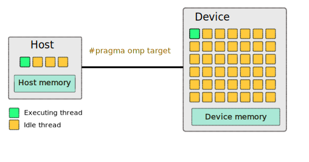
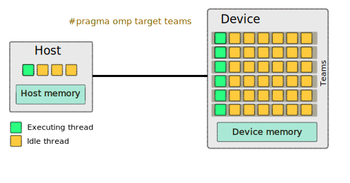
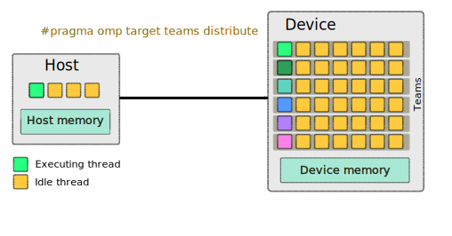
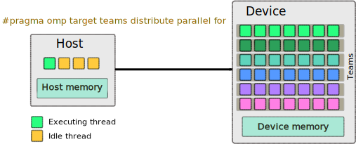

## Introduction to OpenMP Device Offload

As we learned in the *General Parallel Computing* lesson increasing performance is based on various strategies such as CPU frequency, multicore processing, vectorization, parallel distributed computing. At present performance is mostly limited by power consumption. Accelerators such as Nvidia Tesla GPUs are based on a very high level of parallelism and are capable to reach high performance at relatively low power consumption.  GPUs can deliver very high performance per compute node and today, GPGPUs are the choice of hardware to accelerate computational workloads in HPC settings. Let's look at the GPU architecture to understand why they are a good fit for various types of HPC jobs.
{: .instructor_notes}

- GPUs can deliver very high performance per compute node.
- Computing workloads are often accelerated by GPUs in HPC clusters.
{: .self_study_text}

### The GPU Architecture 
Graphics processing units have become one of the most important types of computing technology today. GPU development had predominantly been driven by the gaming industry, and GPUs are best known for their capabilities in video rendering. GPUs were originally developed to accelerate specific 3D rendering tasks. Over time, these fixed-function engines became more programmable and more flexible. While graphics processing remains their principal function, GPUs have evolved to become more general-purpose parallel processors. Today they are handling a growing range of scientific and engineering applications in areas such as machine learning, particle and fluid simulations, drug design, and electronic structure calculations.
{: .instructor_notes}

The main difference between CPU and GPU is that a CPU is designed to handle a wide-range of tasks quickly, but are limited in the number of tasks that can be running concurrently. The CPU focuses its small number of cores on individual tasks and on getting things done quickly. 

GPUs consist of thousands of smaller and more specialized processing units (cores). By working together, the cores deliver massive performance when a processing task can be divided up and processed across many cores. For example, when images are processed, they are divided into small blocks and each processing core works on a small part of the image.
{: .instructor_notes}

Nvidia calls its parallel processing platform Compute Unified Device Architecture (CUDA). 

CUDA cores are the processing units inside an Nvidia GPU just like AMD’s Stream Processors. With a larger number of CUDA cores, processing can be done at a much faster rate due to the fact that this can be done in parallel.
{: .instructor_notes}

CUDA cores are only a part of what Nvidia GPUs offer. Additionally, they are equipped with cores that are specially designed for ray tracing and for tensor operations.
{: .instructor_notes}

- **Nvidia H100 GPUs** 
    - up to 132 Streaming Multiprocessors
    - 128 FP32 CUDA cores per SM
    - total 16896 CUDA cores.  
- **Intel® Xeon® Platinum 9282**  
    - 56 cores
    - 1 AVX-512 vector unit per core can process 16 FP32 numbers at a time.

In summary, GPU architecture enables to process massive amounts of data simultaneously at extremely fast speeds.

### The OpenMP GPU programming model
GPU programming with OpenMP is based on a host-device model.

- The host is where the initial thread of a program begins to run. 
- The host can be connected to one or more GPU devices.
    - Each Device is composed of one or more Compute Units
    - Each Compute Unit is composed of one or more Processing Elements
- Memory is divided into host memory and device memory

#### How many devices are available?
The `omp_get_num_devices` routine returns the number of target devices.

~~~
#include <stdio.h>
#include <omp.h>
 
int main() 
{
  int num_devices = omp_get_num_devices();
  printf("Number of devices: %d\n", num_devices);
}
~~~
{:.language-c}
[device_count.c](https://github.com/ssvassiliev/ACENET_Summer_School_OpenMP_2023/raw/gh-pages/code/device_count.c)

Compile with gcc/11.3.0: 
~~~
module load gcc/11.3.0 
gcc device_count.c -fopenmp -odevice_count
~~~
{:.language-bash}

Run it on the login node. How many devices are available on the login node?

Then run it on a GPU node:
~~~
srun --gpus-per-node=1 ./device_count
~~~
{:.language-bash}

Request two GPUs. How many devices are detected now?

### To offload to a GPU, what steps do you need to take?

- Identify routines suitable for hight throughput accelerators (compute kernels) and offload them to a device.

On the device, this step will initiate a kernel. Look for compute intensive code and that can benefit from parallel execution.Using performance analysis tools may help to find bottlenecks. Ideal offload candidates are independent work units with well-defined data access.
{: .instructor_notes}

- Explicitly express parallelism in the kernel.  
- Manage data transfer between CPU and Device. 

Data needs to be moved from host to device memory because kernel executes using device memory.
After execution, computed data needs to be moved back from device to host memory.
Keep an eye on GPU specs. Since GPU memory is typically smaller than main memory, make sure that all kernel-related data fits there.
{: .instructor_notes}

### Example: compute sum of two vectors. 
Start from the serial code `vadd_gpu_template.c`. 

The program generates two random vectors A and B, and computes their sum C.  In addition, it prints the sum of all elements of the resulting vector C for verification. The sum of these two vectors should be close to 1, since they are both initialized by random numbers between 0 and 1.
{: .instructor_notes}

~~~
/* Compute sum of vectors A and B */
#include <stdio.h>
#include <stdlib.h>
#include <omp.h>

int main(int argc, char *argv[])
{
    double start, end;
    int size = 1e8;
    float *A;
    float *B;
    float *C;
    double sum = 0.0f;

    int ncycles=atoi(argv[1]);
    A = (float *)malloc(size * sizeof(float *));
    B = (float *)malloc(size * sizeof(float *));
    C = (float *)malloc(size * sizeof(float *));

    /* Initialize vectors */
    for (int i = 0; i < size; i++)
    {
        A[i] = (float)rand() / RAND_MAX;
        B[i] = (float)rand() / RAND_MAX;
    }

    start = omp_get_wtime();
    for (int k = 0; k < ncycles; k++)
        for (int i = 0; i < size; i++)
        {
            C[i] = A[i] + B[i];
            sum += C[i];
        }
    end = omp_get_wtime();

    printf("Time: %f seconds\n", end - start);
    sum = sum / size;
    printf("Sum = %f\n ", sum / ncycles);
}
~~~
{:.language-c}
[vadd_gpu_template.c](https://github.com/ssvassiliev/ACENET_Summer_School_OpenMP_2023/raw/gh-pages/code/vadd_gpu_template.c)

~~~
gcc vadd_gpu_template.c -fopenmp -O3 -ovadd_serial 
~~~
{:.language-bash}

In order to get an accurate timing on GPUs, we must run summation multiple times. The number of repeats can be specified on the command line:

~~~
srun --gpus-per-node 1 --mem=5000 -c4 ./vadd_serial 10
~~~
{:.language-bash}

Execution time of the serial code is around 1.6 sec.

### How to Offload: the OpenMP Target Directive

- OpenMP offload constructs were introduced in OpenMP 4.0.

 OpenMP `target` instructs the compiler to generate a target task, which executes the enclosed code on the target device.

Make a copy of the code:
~~~
cp vadd_gpu_template.c vadd_gpu.c
~~~
{:.language-bash}

Identify code block we want to offload to GPU and generate a target task:  
~~~
...
#pragma omp target
    {
        for (int i = 0; i < size; i++)
        {
            C[i] = A[i] + B[i];
            sum += C[i];
        }
    }
~~~
{:.language-c}

Compile and run on a GPU node:
~~~
gcc vadd_gpu.c -fopenmp -O3 -ovadd_gpu 
srun --gpus-per-node 1 --mem=5000 -c4 ./vadd_gpu 10
~~~
{:.language-bash}

~~~
libgomp: cuCtxSynchronize error: an illegal memory access was encountered
~~~
{:.output}

The compiler created target task and offloaded it to a GPU, but the data is on the host!

### The OpenMP Map directive.

#### map(map-type: list[0:N])
- **map-type** may be **to**, **from**, **tofrom**, or **alloc**. The clause defines how the variables in list are moved between the host and the device.

~~~
...
#pragma omp target map(to: A[0:size],B[0:size]) map(from: C[0:size], sum)
~~~
{:.language-c}

Compile and run on a GPU node:
~~~
gcc vadd_gpu.c -fopenmp -O3 -ovadd_gpu 
srun --gpus-per-node 1 --mem=5000 -c4 ./vadd_gpu 1
~~~
{:.language-bash}

Execution time of the offloaded code is slower, around 8 sec. It is expected because:

1. By using the `omp target` directive, a target task is created, offloaded to the GPU, but is not parallelized. It executes on a single thread.
2. The processors on GPUs are slower than the CPUs.
3. It takes some time for data to be transferred from the host to the device. 

### The OpenMP Teams directive.

- `teams` construct creates a league of teams.
- the master thread of each team executes the code 
{:.self_study_taxt}

Using the `teams` construct is the first step to utilizing multiple threads on a device. A `teams` construct creates a league of teams. Each team consists of some number of threads, when the directive `teams` is encountered the master thread of each team executes the code in the teams region.
{:.instructor_notes}

~~~
...
#pragma omp target teams map(to: A[0:size],B[0:size]) map(from: C[0:size], sum)
~~~
{:.language-c}

Compile and run on a GPU node:
~~~
gcc vadd_gpu.c -fopenmp -O3 -ovadd_gpu 
srun --gpus-per-node 1 --mem=5000 -c4 ./vadd_gpu 1
~~~
{:.language-bash}

Execution time is the same! 

Now we have multiple threads executing on the device, however they are all performing the same work.

It is also important to note that only the master thread for each team is active.

### Review

Right now we have:
- Multiple thread teams working on a device
- All thread teams are performing the same work
- Only the master thread of each team is executing 

### The OpenMP Distribute directive.

The distribute construct can be used to spread iterations of a loop among teams.

~~~
...
#pragma omp target teams distribute map(to: A[0:size],B[0:size]) map(from: C[0:size], sum)
~~~
{:.language-c}

Compile and run on a GPU node:
~~~
gcc vadd_gpu.c -fopenmp -O3 -ovadd_gpu 
srun --gpus-per-node 1 --mem=5000 -c4 ./vadd_gpu 1
~~~
{:.language-bash}

Execution time is faster, about 1 sec, but how it compares with the CPU version?

~~~
gcc vadd_gpu_template.c -O3 -fopenmp -ovadd_serial
srun  --mem=5000 -c4 ./vadd_serial 1
~~~
{:.language-bash}

This is disappointing, serial version running on a single CPU is 5 times faster!

The master thread is the only one we have used so far out of all the threads available in a team!

At this point, we have teams performing independent iterations of this loop, however each team is only executing serially. In order to work in parallel within a team we can use threads as we normally would with the basic OpenMP usage. Composite constructs can help. 
{:.instructor_notes}

The `distribute parallel for` construct specifies a loop that can be executed in parallel by multiple threads that are members of multiple teams.

~~~
...
#pragma omp target teams distribute parallel for map(to: A[0:size],B[0:size]) map(from: C[0:size], sum)
~~~
{:.language-c}

Compile and run on a GPU node:
~~~
gcc vadd_gpu.c -fopenmp -O3 -ovadd_gpu 
srun --gpus-per-node 1 --mem=5000 -c4 ./vadd_gpu 1
~~~
{:.language-bash}

Now, we have teams splitting the work into large chunks on the device, while threads within the team will further split the work into smaller chunks and execute in parallel.
{:.instructor_notes}

We have two problems:
1. It did not take less time to execute.
2. The sum is not calculated correctly.

Maybe the work is not large enough for the GPU? To increase the amount of calculations, we could repeat the loop multiple times. Try running 20 cycles of addition. Did the execution time increase 20 times?
It took only 7 seconds instead of the expected 20 seconds. We are on the right track, but what else can be improved in our code to make it more efficient?

### The OpenMP Target Data directive.
Each time we iterate, we transfer data from the host to the device, and we pay a high cost for data transfer. Arrays A and B can only be transferred once at the beginning of calculations, and the results can only be returned to the host once the calculations are complete. The `target data` directive can help with this.
{:.instructor_notes}

The `target data` directive maps variables to a device data environment for the extent of the region.

~~~
...
#pragma omp target data map(to: A[0:size], B[0:size]) map(from: C[0:size], sum)
{
    for (int k = 0; k < ncycles; k++)
#pragma omp target teams distribute parallel for reduction(+:sum)
        for (int i = 0; i < size; i++)
        {
            C[i] = A[i] + B[i];
            sum += C[i];
        }
 }
~~~
{:.language-c}

Compile and run on a GPU node for 20 cycles:
~~~
gcc vadd_gpu.c -fopenmp -O3 -ovadd_gpu 
srun --gpus-per-node 1 --mem=5000 -c4 ./vadd_gpu 20
~~~
{:.language-bash}

The time decreased from 7 to 1 sec! 
Try running for 1000 cycles. Did the time increase proportionally to the work?

Let's take care of issue with sum. 

We get the wrong result with sum, it is zero, so it looks like it is not transferred back from the device.
{:.instructor_notes}

~~~
...
#pragma omp target data map(to: A[0:size], B[0:size]) map(from: C[0:size])
{
    for (int k = 0; k < ncycles; k++)
#pragma omp target teams distribute parallel for reduction(+:sum) map(tofrom:sum)
        for (int i = 0; i < size; i++)
        {
            C[i] = A[i] + B[i];
            sum += C[i];
        }
 }
~~~

We need to add a reduction clause and map sum tofrom the device since we parallelized the for loop.
{:.instructor_notes}

#### Using Nvidia HPC compiler
Nvidia HPC compiler generates faster binary, but it does not run on the training cluster.
~~~
module load nvhpc/22.7
nvc vadd_gpu.c -O3 -fopenmp -mp=gpu -Minfo=mp 
nvc vadd_gpu.c -O3 -fopenmp -mp=multicore -Minfo=mp 
~~~
{:.language-bash}

## Getting info about available GPUs
### Nvidia-smi
~~~
nvidia-smi --query-gpu=timestamp,utilization.gpu,utilization.memory -format=csv -l 1 >& gpu.log&
~~~
{:.language-bash}

### Getting info about available GPUs programmatically
~~~
#include <stdio.h>
#include <omp.h>

int main()
{
    int nteams, nthreads;
    int num_devices = omp_get_num_devices();
    printf("Number of available devices %d\n", num_devices);

#pragma omp target teams defaultmap(tofrom : scalar)
    {
        if (omp_is_initial_device())
            printf("Running on host\n");
        else
        {
            nteams = omp_get_num_teams();
#pragma omp parallel
#pragma omp single
            if (!omp_get_team_num())
            {
                nthreads = omp_get_num_threads();
                printf("Running on device with %d teams x %d threads\n", nteams, nthreads);
            }
        }
    }
}
~~~
{:.language-c}
  
Compile with gcc/11.3.0: 
~~~
module load gcc/11.3.0 
gcc get_device_info.c -fopenmp -ogpuinfo
~~~
{:.language-bash}

~~~
srun --gpus-per-node=1 --mem=1000 ./gpuinfo 
~~~
{:.language-bash}

With gcc/11 you will get 216 teams x 8 threads (Quadro RTX 6000)

Compile with nvidia compiler:

~~~
module load nvhpc/22.7
nvc get_device_info.c -mp=gpu -ogpuinfo
srun --gpus-per-node=1 --mem=1000 ./gpuinfo 
~~~
{:.language-bash}

With nvhpc you'll get 72 teams x 992 threads on the same GPU.

