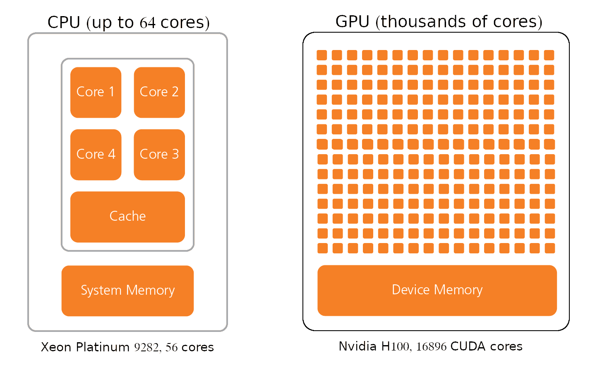
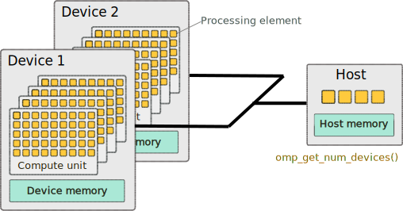
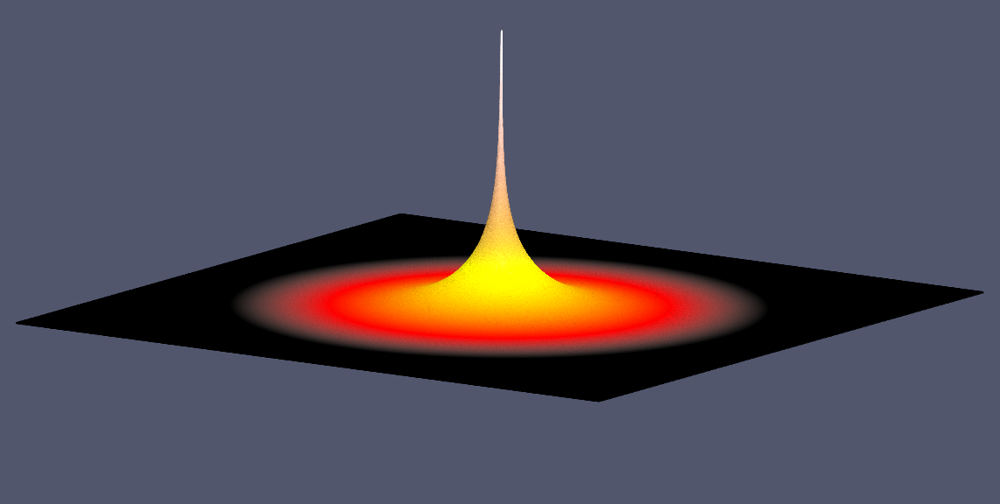

## Introduction to OpenMP Device Offload

As we learned in the *General Parallel Computing* lesson increasing performance is based on various strategies such as CPU frequency, multicore processing, vectorization, parallel distributed computing. At present performance is mostly limited by power consumption. Accelerators such as Nvidia Tesla GPUs are based on a very high level of parallelism and are capable to reach high performance at relatively low power consumption.  GPUs can deliver very high performance per compute node and today, GPGPUs are the choice of hardware to accelerate computational workloads in HPC settings. Let's look at the GPU architecture to understand why they are a good fit for various types of HPC jobs.
{: .instructor_notes}

- GPUs can deliver very high performance per compute node.
- Computing workloads are often accelerated by GPUs in HPC clusters.
{: .self_study_text}

### The GPU Architecture 
Graphics processing units have become one of the most important types of computing technology today. GPU development had predominantly been driven by the gaming industry, and GPUs are best known for their capabilities in video rendering. GPUs were originally developed to accelerate specific 3D rendering tasks. Over time, these fixed-function engines became more programmable and more flexible. While graphics processing remains their principal function, GPUs have evolved to become more general-purpose parallel processors. Today they are handling a growing range of scientific and engineering applications in areas such as machine learning, particle and fluid simulations, drug design, and electronic structure calculations.

The main difference between CPU and GPU is that a CPU is designed to handle a wide-range of tasks quickly, but are limited in the number of tasks that can be running concurrently. The CPU focuses its small number of cores on individual tasks and on getting things done quickly. 

GPUs consist of thousands of smaller and more specialized processing units (cores). By working together, the cores deliver massive performance when a processing task can be divided up and processed across many cores. For example, when images are processed, they are divided into small blocks and each processing core works on a small part of the image.

Nvidia calls its parallel processing platform Compute Unified Device Architecture (CUDA). CUDA cores are the processing units inside an Nvidia GPU just like AMD’s Stream Processors. With a larger number of CUDA cores, processing can be done at a much faster rate due to the fact that this can be done in parallel.

CUDA cores are only a part of what Nvidia GPUs offer. Additionally, they are equipped with cores that are specially designed for ray tracing and for tensor operations.

- **Nvidia H100 GPUs** 
    - up to 132 Streaming Multiprocessors
    - 128 FP32 CUDA cores per SM
    - total 16896 CUDA cores.  
- **Intel® Xeon® Platinum 9282**  
    - 56 cores
    - 1 AVX-512 vector unit per core can process 16 FP32 numbers at a time.

In summary, GPU architecture enables to process massive amounts of data simultaneously at extremely fast speeds.

### The OpenMP GPU programming model
GPU programming with OpenMP is based on a host-device model.

- The host is where the initial thread of a program begins to run. 
- The host can be connected to one or more GPU devices.
    - Each Device is composed of one or more Compute Units
    - Each Compute Unit is composed of one or more Processing Elements
- Memory is divided into host memory and device memory

#### How many devices are available?
The `omp_get_num_devices` routine returns the number of target devices.

~~~
#include <stdio.h>
#include <omp.h>
 
int main() 
{
  int num_devices = omp_get_num_devices();
  printf("Number of devices: %d\n", num_devices);
}
~~~
{:.language-c}
[device_count.c]()

Compile with gcc/11.3.0: 
~~~
module load gcc/11.3.0 
gcc device_count.c -fopenmp -odevice_count
~~~
{:.language-bash}

Run it on the login node. How many devices are available on the login node?

Then run it on a GPU node:
~~~
srun --gpus-per-node=1 ./device_count
~~~
{:.language-bash}

Request two GPUs. How many devices are detected now?

### To offload to a GPU, what steps do you need to take?

- Identify routines suitable for hight throughput accelerators (compute kernels) and offload them to a device.

On the device, this step will initiate a kernel. Look for compute intensive code and that can benefit from parallel execution.Using performance analysis tools may help to find bottlenecks. Ideal offload candidates are independent work units with well-defined data access.
{: .instructor_notes}

- Explicitly express parallelism in the kernel.  
- Manage data transfer between CPU and Device. 

Data needs to be moved from host to device memory because kernel executes using device memory.
After execution, computed data needs to be moved back from device to host memory.
Keep an eye on GPU specs. Since GPU memory is typically smaller than main memory, make sure that all kernel-related data fits there.
{: .instructor_notes}

### How to Offload: the OpenMP Target Directive

- OpenMP offload constructs were introduced in OpenMP 4.0.

The omp target directive instructs the compiler to generate a target task, that is, to map variables to a device data environment and to execute the enclosed block of code on that device.

## Getting info about available GPUs

### Nvidia-smi
~~~
srun --gpus-per-node=1 --mem=1000 nvidia-smi
~~~
{:.language-bash}

### Getting info about available GPUs programmatically

Compile with gcc/11.3.0 
~~~
module load gcc/11.3.0 
gcc get_device_info.c -fopenmp -ogpuinfo
~~~
{:.language-bash}

ml nvhpc

#### Compiling openMP program for execution on GPUs.
-mp=gpu: 
OpenMP directives are compiled for GPU execution plus multicore CPU fallback; this feature is supported on NVIDIA V100 or later GPUs.

~~~
#include <stdio.h>
#include <omp.h>
 
int main() 
{
  int nteams, nthreads;
  int num_devices = omp_get_num_devices();
  printf("Number of available devices %d\n", num_devices);

  #pragma omp target teams defaultmap(tofrom:scalar)
  {
       if (omp_is_initial_device()) 
           printf("Running on host\n");
	else {
          nteams=omp_get_num_teams(); 
          #pragma omp parallel
          #pragma omp single
	  if(!omp_get_team_num())
            {
	     nthreads=omp_get_num_threads();
	     printf("Running on device with %d teams x %d threads\n",nteams,nthreads);
	    }
  }
 }
}
~~~
{:.language-c}
  
 
~~~
srun --gpus-per-node=1 --mem=1000 ./gpuinfo 
~~~
{:.language-bash}

With gcc/11 you will get 216 teams x 8 threads (Quadro RTX 6000)

Compile with nvidia compiler:

~~~
nvc get_device_info.c -mp=gpu
~~~
{:.language-bash}

With nvhpc you'll get 72 teams x 992 threads on the same GPU.

## Let's see what is the performance

#include <stdio.h>
#include <time.h>

~~~
int main (void) {
  long int sum = 0;
  struct timespec ts_start, ts_end;
  float time_total;

clock_gettime(CLOCK_MONOTONIC, &ts_start);
#pragma omp parallel for reduction(+:sum)
//#pragma omp target map(tofrom:sum)
//#pragma omp teams distribute parallel for reduction(+:sum)
for(long int i = 0 ; i < 9000000000; i++) {
    sum += i%11;
  }
  printf("sum = %li\n",sum);

clock_gettime(CLOCK_MONOTONIC, &ts_end);

time_total = (ts_end.tv_sec - ts_start.tv_sec) * 1e9 + (ts_end.tv_nsec - ts_start.tv_nsec);
printf("\nTotal time is %f sec\n", time_total / 1e9);
return 0;
}
~~~
{:.language-c}

Compile:
`gcc omp_sum_gpu.c -fopenmp -O3`
Run on 16 CPUs
srun --gpus-per-node=1 ./a.out

### Tools for Programming GPUs
 There are several tools available for programming GPU.
 - CUDA. CUDA is NVIDIA-specific programming model and language. You can get the most out of your GPU with CUDA. CUDA-C and CUDA-Fortran compilers are available. Difficult to program, porting existing C/C++ or Fortran code onto the GPU with CUDA requires significant code refactoring.
 - OpenMP via the `target` construct. [OpenMP on GPUs](https://on-demand.gputechconf.com/gtc/2018/presentation/s8344-openmp-on-gpus-first-experiences-and-best-practices.pdf)
 - OpenCL. Open Computing Language is a framework that allows to write programs executing across platforms consisting of CPU, GPU, FPGA, and other hardware accelerators. It is very complex and hard to program. Adoption of OpenCL is still low.
 - PyCuDA. Gives access to CUDA functionality from Python code.
 - OpenACC. OpenACC offers a quick path to accelerated computing with less programming effort.

Examples of OpenACC accelerated applications: 
- VASP 6 (*ab initio* atomic scale modeling).[NVIDIA GPU Accelerated VASP 6 uses OpenACC to Deliver 15X More Performance](https://developer.nvidia.com/blog/nvidia-gpu-accelerated-vasp-6-uses-openacc-to-deliver-15x-more-performance/)
- TINKER 9 (molecular dynamics)  

### OpenACC Compilers
- GCC
- PGI
- Nvidia HPC SDK 

### Solving the Discrete Poisson's Equation Using Jacobi's Method.
Poisson's equation arises in heat flow, diffusion, electrostatic and gravitational potential, fluid dynamics, .. etc. The governing equations of these processes are partial differential equations, which describe how each of the variables changes as a function of all the others.

$$ \nabla^2U(x,y)=f(x,y) $$

Here $ \nabla $ is the discrete Laplace operator, $ f(x,y) $ is a known function, and $ U(x,y) $ is the function to be determined.

This equation describes, for example, steady-state temperature of a uniform square plate. To make a solution defined we need to specify boundary conditions, i.e the value of $ U $ on the boundary of our square plate. 

- We will consider the simple case with the boundaries kept at temperature $ U = 0 $. 
- We will place a continuous point heat source in the middle of the plate ($ f(x,y)=0 $ everywhere except one hot spot in the middle of the plate.).

#### Jacobi's Stencil in 2D.
- Common useful iterative algorithm.  
- For discretization on a uniform spatial grid $ n\times m $ the solution can be found by iteratively computing next value at the grid point $ i,j $ as an average of its four neighboring values and the function $ f(i,j) $.

$$ U(i,j,m+1) = ( U(i-1,j,m) + U(i+1,j,m) + U(i,j-1,m) + U(i,j+1,m) + f(i,j) )/4 $$

#### Solution
{:width="400"}

#### Serial Jacobi Relaxation Code
~~~
/* File: laplace2d.c */
#include <math.h>
#include <string.h>
#include <stdio.h>
#include <stdlib.h>
#include <time.h>

int main(int argc, char **argv)
{
    FILE *output_unit;
    int i, j;
    int n = 1024;
    int m = 1024;            /* Size of the mesh */
    int qn = (int)n * 0.5;   /* x-coordinate of the point heat source */
    int qm = (int)m * 0.5;   /* y-coordinate of the point heat source */
    float h = 0.05;          /* Instantaneous heat */
    int iter_max = 1e8;      /* Maximum number of iterations */
    const float tol = 1e-6f; /* Tolerance */

    struct timespec ts_start, ts_end;
    float time_total;
    float ** U, **U_new;
    float ** F;

    /* Allocate memory */
    F = (float **)malloc(m * sizeof(float *)); /* Heat source array */
    for (i = 0; i < m; i++)
        F[i] = malloc(n * sizeof(float));
    F[qn][qm] = h;                             /* Set point heat source */
    U = (float **)malloc(m * sizeof(float *)); /* Plate temperature */
    for (i = 0; i < m; i++)
        U[i] = malloc(n * sizeof(float));
    U_new = (float **)malloc(m * sizeof(float *)); /* Temporary new temperature */
    for (i = 0; i < m; i++)
        U_new[i] = malloc(n * sizeof(float));

    printf("Jacobi relaxation calculation: %d x %d mesh\n", n, m);
    /* Get calculation  start time */
    clock_gettime(CLOCK_MONOTONIC, &ts_start);

    /* The main loop */
    int iter = 0;       /* Iterration counter */
    float error = 1.0f; /* The initial error */
    while (error > tol && iter < iter_max)
    {
        error = 0.f;
        /* Compute the new temperature  at the point i,j as a weighted average of */
        /* the four neighbors and the heat source function F(i,j) */
        {
            for (j = 1; j < n - 1; j++)
            {
                for (i = 1; i < m - 1; i++)
                {
                    U_new[j][i] = 0.25f * (U[j][i + 1] + U[j][i - 1] + U[j - 1][i] + U[j + 1][i]) + F[j][i];
                    error = fmaxf(error, fabsf(U_new[j][i] - U[j][i]));
                }
            }
            /*  Update temperature */
            for (int j = 1; j < n - 1; j++)
            {
                for (i = 1; i < m - 1; i++)
                    U[j][i] = U_new[j][i];
            }
            if (iter % 200 == 0) /* Print error every 200 iterrations */
                printf("%5d, %0.6e\n", iter, error);
            iter++;
        }
    }

    /* Get end time */
    clock_gettime(CLOCK_MONOTONIC, &ts_end);
    time_total = (ts_end.tv_sec - ts_start.tv_sec) * 1e9 + (ts_end.tv_nsec - ts_start.tv_nsec);
    printf("\nTotal relaxation time is %f sec\n", time_total / 1e9);

    /* Write data to a binary file for paraview visualization */
    char *output_filename = "poisson_1024x1024_float32.raw";
    output_unit = fopen(output_filename, "wb");
    for (j = 0; j < n; j++)
        fwrite(U[j], m * sizeof(float), 1, output_unit);
    fclose(output_unit);
}

~~~
{:.language-c}

#### Performance of the Serial Code
Compile and run
~~~
gcc laplace2d.c -lm -O3
~~~
{:.language-bash}

The serial code with 2048x2048 mesh does 10,000 iterations in 233 sec. 
Are the *for* loops at lines 50, 52, 59, and 61 vectorized?
~~~
gcc laplace2d.c -lm -O3 -fopt-info-vec-missed
~~~
{:.language-bash}

#### Performance of the Auto-vectorized Code
Try Intel compiler:
~~~
module load StdEnv/2020 intel/2021.2.0
icc -qopt-report=1 -qopt-report-phase=vec -O3 laplace2d.c
~~~
{:.language-bash}

Only the *for* loop at line 52 is vectorized, the code runs in 136 sec. 

### Parallelizing Jacobi Relaxation Code with OpenACC
#### The *acc kernels* Construct
Let’s add a single, simple OpenACC directive before the block containing *for* loop nests at lines 50 and 59. 
~~~
#pragma acc kernels
~~~
{:.language-c}

This pragma tells the compiler to generate parallel accelerator kernels (CUDA kernels in our case) for the block of loop nests following the directive. 

#### Compiling with Nvidia HPC SDK
Load the Nvidia HPC module:
~~~
module load StdEnv/2020 nvhpc/20.7 cuda/11.0
~~~
{:.language-bash}

To compile the code with OpenACC we need to add a couple of options:
- tell the nvc compiler to compile OpenACC directives (*-acc*)
- compile for target architecture NvidiaG Tesla GPU (*-ta=tesla*) 

~~~
nvc laplace2d.c -O3 -acc -ta=tesla 
~~~
{:.language-bash}

Let’s run the program. Uh oh, that’s a bit of a slow-down compared even to our serial CPU code. 

Were the loops parallelized? 
- enable printing information about the parallelization ( add the option *-Minfo=accel*) and recompile

~~~
nvc laplace2d.c -O3 -acc -ta=tesla -Minfo=accel
~~~
{:.language-bash}

~~~
     50, Complex loop carried dependence of U->->,F->->,U_new->-> prevents parallelization
     52, Complex loop carried dependence of U->->,F->->,U_new->-> prevents parallelization
     ...
     59, Complex loop carried dependence of U_new->->,U->-> prevents parallelization
     61, Complex loop carried dependence of U_new->->,U->-> prevents parallelization
~~~
{:.output}

No, the compiler detected data dependency in the loops and refused to parallelize them. What is the problem?

#### The *__restrict* Type Qualifier
Our data arrays (U, Unew, F) are dynamically allocated and are accessed via pointers. To be more precise via pointers to pointers (float **). A pointer is the address of a location in memory. More than one pointer can access the same chunk of memory in the C language, potentially creating data dependency. How can this happen?
  
Consider a loop:
~~~
    for (i=1; i<N; i++)
          a[i] = b[i] + c[i];
~~~
{:.language-c}

At the first glance there is no data dependency, however the C language puts very few restrictions on pointers. For example arithmetic operations on pointers are allowed. What if *b = a - 1*? That is *b* is just *a* offset by one array index.

The loop becomes
~~~
    for (i=1; i<N; i++)
          a[i] = a[i-1] + c[i];
~~~
{:.language-c}

It is now apparent that the loop has a READ after WRITE dependency and is not vectorizable.   

The compiler's job in deciding on the presence of data dependencies is pretty complex. For simple loops like the one above, modern compilers can automatically detect the potential data dependencies and take care of them. However, if a loop is more complex with more manipulations in indexing, compilers will not try to make a deeper analysis and refuse to vectorize the loop.

Fortunately, you can fix this problem by giving the compiler a hint that it is safe to make optimizations.  To assure the compiler that the pointers are safe, you can use the *__restrict* type qualifier.  Applying the *__restrict* qualifier to a pointer ensures that the pointer is the only way to access the underlying object. It eliminates the potential for pointer aliasing, enabling better optimization by the compiler.   

Let's modify definitions of the arrays (*U, Unew, F*) applying the *__restrict* qualifier and recompile the code:
~~~
float ** __restrict U;
float ** __restrict Unew;
float ** __restrict F;
~~~
{:.language-c}
~~~
nvc laplace2d.c -O3 -acc -ta=tesla -Minfo=accel
~~~
{:.language-bash}
Now the loops are parallelized:
~~~
     50, Loop is parallelizable
         Generating implicit copyin(U[:2048][:2048],F[1:2046][1:2046]) [if not already present]
         Generating implicit copy(error) [if not already present]
         Generating implicit copyout(U_new[1:2046][1:2046]) [if not already present]
     52, Loop is parallelizable
         Generating Tesla code
         50, #pragma acc loop gang, vector(4) /* blockIdx.y threadIdx.y */
             Generating implicit reduction(max:error)
         52, #pragma acc loop gang, vector(32) /* blockIdx.x threadIdx.x */
     57, Generating implicit copyin(U_new[1:2046][1:2046]) [if not already present]
         Generating implicit copyout(U[1:2046][1:2046]) [if not already present]
     60, Loop is parallelizable
     62, Loop is parallelizable
         Generating Tesla code
         60, #pragma acc loop gang, vector(4) /* blockIdx.y threadIdx.y */
         62, #pragma acc loop gang, vector(32) /* blockIdx.x threadIdx.x */
~~~
{:.output}

The loops are parallelized and Tesla code is generated! The performance is somewhat better but still slower than serial.

What else may be the problem? 

The problem is that the data is copied to the GPU every time the program enters the kernels region and copies the data back to the CPU each time it exits the kernels region. The transfer of data from CPU to GPU is much slower than transfers from the main memory to CPU or from video memory to GPU, so it becomes a huge bottleneck. We don't need to transfer data at every loop iteration. We could transfer data once at the beginning of the calculations and get it out at the end. OpenACC has a directive to tell the compiler when data needs to be transferred.

#### The *acc data* Construct
The *acc data* construct has five clauses:
- copy
- copyin
- copyout
- create
- present

Their names describe their obvious functions. 

- The *copy*, clause copies data to the accelerator when entering the *data* region and back from the accelerator to the host when exiting the data region. 
- The *copyin* clause copies data to the accelerator when entering the *data* region but it does not copy data back
- The *copyout* is used only to return data from a directive region to the host.

We need to transfer *U, Unew* and *F* to the accelerator, but we need only *U* back. Therefore, we will use *copyin* and *copyout* clauses. As we use pointers, compiler does not know dimensions of the arrays, so we need to specify dimensions. 

~~~
#pragma acc data copyin(U[0:m][0:n], U_new[0:m][0:n], F[0:m][0:n]) copyout(U[0:m][0:n])
~~~
{:.language-c}

Now the code runs much faster!

### The *acc parallel* Construct
- Defines the region of the program that should be compiled for parallel execution on the accelerator device.
- The *parallel loop* directive is an assertion by the programmer that it is both safe and desirable to parallelize the affected loop. 
- The *parallel loop* construct allows for much more control of how the compiler will attempt to structure work on the accelerator. The *loop* directive gives the compiler additional information about the next loop in the source code through several clauses
    - *independent* – all iterations of the loop are independent
    - *collapse(N)* - turn the next N loops into one, flattened loop
    - *tile(N,[M])* break the next 1 or more loops into tiles based on the provided dimensions.

An important difference between the *acc kernels* and *acc parallel* constructs is that with *kernels* the compiler will analyze the code and only parallelize when it is certain that it is safe to do so. 

In some cases, the compiler may not be able to determine whether a loop is safe the parallelize, even if you can clearly see that the loop is safely parallel. The kernels construct gives the compiler maximum freedom to parallelize and optimize the code for the target accelerator.  It also relies most heavily on the compiler’s ability to automatically parallelize the code.

### Fine Tuning Parallel Constructs: the *gang*, *worker*, and *vector* Clauses
OpenACC has 3 levels of parallelism:
1. Vector threads work in SIMD parallelism
2. Workers compute a vector
3. Gangs have 1 or more workers. A gang have shared resources (cahce, streaming multiprocessor ). Gangs work independently of each other.

*gang*, *worker*, and *vector* can be added to a *loop* clause. Since different loops in a kernels region may be parallelized differently, fine-tuning is done as a parameter to the gang, worker, and vector clauses.

### Portability from GPUs to CPUs
We can add OpenMP directives along with the OpenACC directives. Then depending on what options are passed to the compiler we can build ether multiprocessor or accelerator versions.

Let's apply OpenMP directives and 
~~~
#pragma omp parallel for private(i) reduction(max:error)
~~~
{:.language-c}

to the loop at line 50 and  
~~~
#pragma omp parallel for private(i)
~~~
to the loop at line 59
{:.language-c}

~~~
nvc laplace2d.c -mp -O3 
~~~
{:.language-bash}
[View NVIDIA HPC-SDK](https://docs.nvidia.com/hpc-sdk/compilers/index.html) documentation.

 