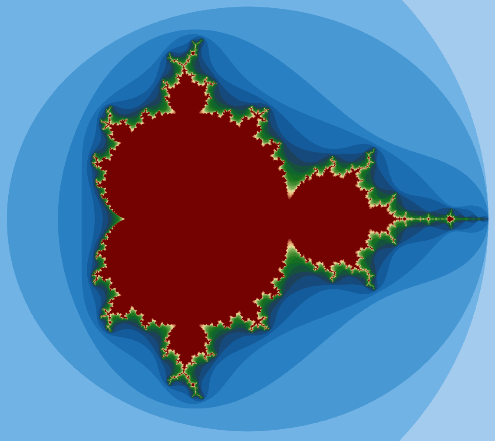

The <a href="https://en.wikipedia.org/wiki/Mandelbrot_set">Mandelbrot set</a>
was a hot subject of computer art in the 1980s.  The algorithm is quite simple:
- For each point on the screen, do an iterative calculation and decide whether the calculation diverges or not. 
- Color that spot on the screen according to how many iterations it took to diverge or brown if it didn't diverge in 1000 iterations.

~~~
#include <stdlib.h>
#include <stdio.h>
#include <math.h>
#include <time.h>

int main()
{
  int m = 2048;         /* Image x - dimension */
  int n = 2048;         /* Image y - dimension */
  double lim = 4.0;     /* Limit to determine convergence */
  int count_max = 1000; /* maximum number of iterations */
  /* Region of interest */
  double x_max = 1.25;
  double x_min = -2.25;
  double y_max = 1.75;
  double y_min = -1.75;

  struct timespec ts_start, ts_end;
  float time_total;
  int i, j, k;
  FILE *output_unit;
  int **count;
  double x, x1, x2, y, y1, y2;

  count = (int **)malloc(m * sizeof(int *));
  for (i = 0; i < m; i++)
    count[i] = malloc(n * sizeof(int));

  clock_gettime(CLOCK_MONOTONIC, &ts_start);
  /* Carry out the iteration for each pixel, determining the number   */
  /* of iterations required for the new point (x2,y2) to move away    */
  /* from the original point (x,y) by the predefined distance (limit) */
  for (i = 0; i < m; i++)
  {
    y = ((i - 1) * y_max + (m - i) * y_min) / (m - 1);
    for (j = 0; j < n; j++)
    {
      x = ((j - 1) * x_max + (n - j) * x_min) / (n - 1);
      count[i][j] = 0;
      x1 = x;
      y1 = y;
      /* Loop checking convergence */
      k=0;
      while ((k++ < count_max) && (x1*x1 + y1*y1 < lim))
      {
        x2 = x1 * x1 - y1 * y1 + x;
        y2 = 2 * x1 * y1 + y;
        x1 = x2;
        y1 = y2;
      }
      count[i][j] = k;
    }
  }
  clock_gettime(CLOCK_MONOTONIC, &ts_end);
  time_total = (ts_end.tv_sec - ts_start.tv_sec) * 1e9 + (ts_end.tv_nsec - ts_start.tv_nsec);
  printf("\nTotal time is %f ms", time_total / 1e6);

  /* Write data to a binary file for visualization with paraview */
  char *output_filename = "mandel_2048x2048_int.raw";
  output_unit = fopen(output_filename, "wb");
  for (j = 0; j < n; j++)
    fwrite(count[j], m * sizeof(int), 1, output_unit);
  fclose(output_unit);
}
~~~
{: .language-c}

#### Calculation result visualized with paraview. 
{:width="400"}

- First, compile and run the program without OpenMP.
- Note how long it took to run. A millisecond is not enough to get good performance measurements on.
- Next, increase the dimensions `m,n` to `3000,3000` and recompile. Check the run time.

Now comes the parallelization.

> ## Parallelize the Mandelbrot Code
> 1. Decide what variable or variables should be made private, and then compile and test the code.
> 2. Run on few different numbers of CPUs. How does the performance scale?
> 3. Try different scheduling types. How does it affect the performance? What seems to work best for this problem? 
{: .challenge}

 